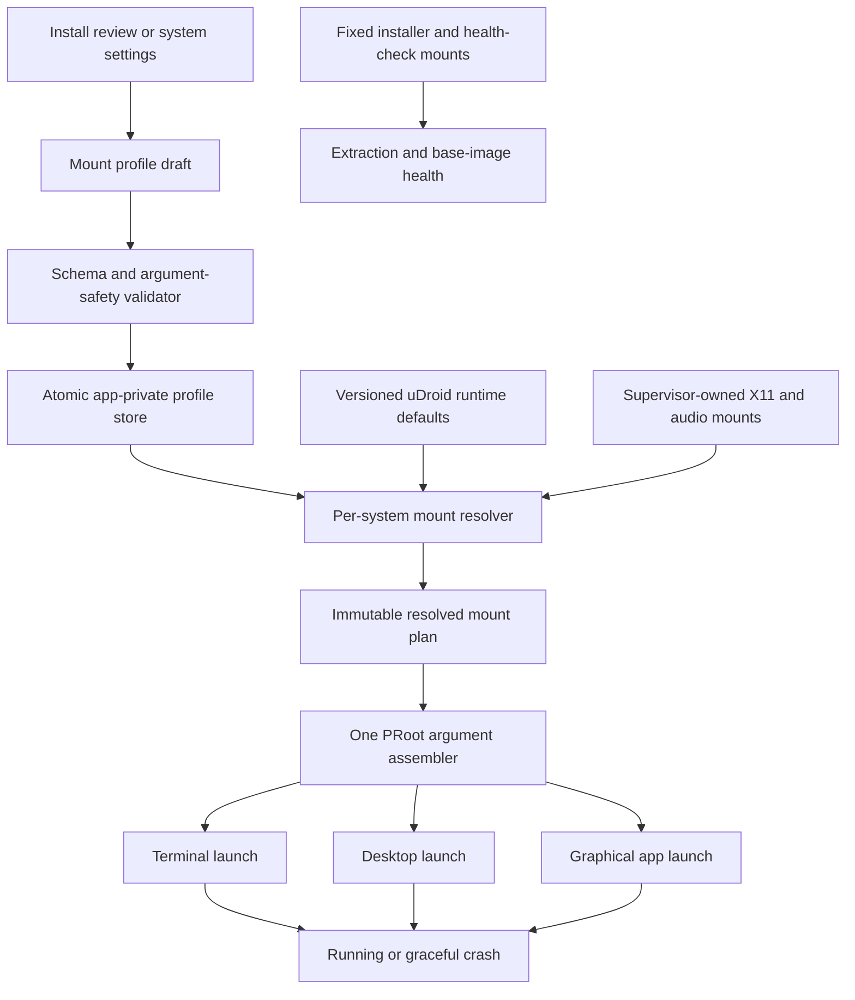
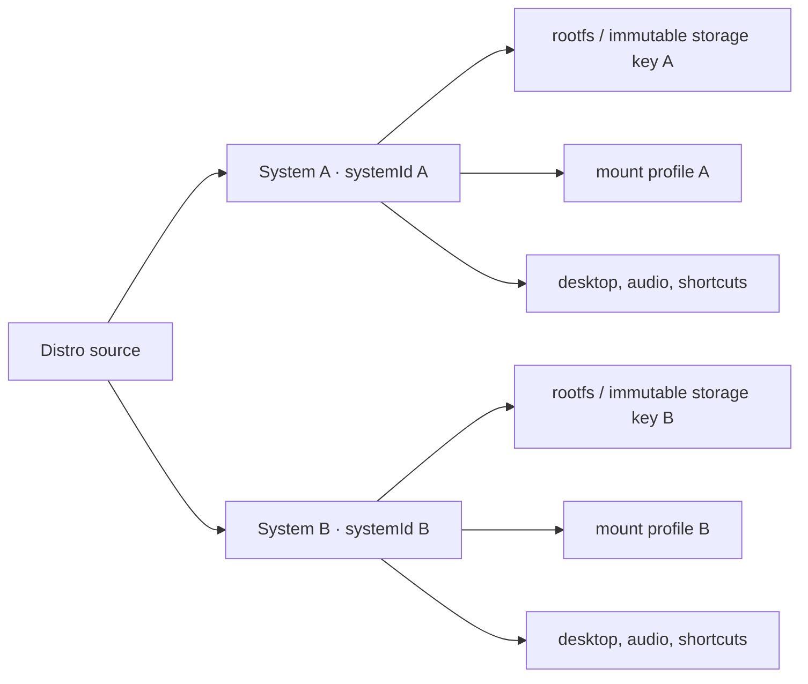

# Configurable PRoot mount mappings

Status: implemented design and architecture, 2026-08-13
Scope: distro-scoped mount profiles and independently installed variations.

## Decision summary

Mount mappings should belong to an installed Linux **system instance**, not to
the catalogue distro definition and not to the rootfs contents. A user may
therefore install Ubuntu 22.04 LTS more than once, give each installation a
different name, filesystem, and mount profile, and run each as a separate
uDroid system.

The first implementation should:

1. add a mount-mapping editor to the install review and installed-system page;
2. preserve the current Android binds as versioned uDroid defaults;
3. let defaults be enabled or disabled, and let custom mappings be added,
   disabled, or deleted;
4. restore the exact current uDroid defaults with one explicit action;
5. store only per-system overrides and custom mappings outside the guest
   rootfs;
6. resolve one immutable mount plan before any terminal, desktop, or graphical
   application is started, validating only that it can be represented safely as
   a PRoot argument vector;
7. keep installer/extraction mounts and session-owned X11/audio mounts outside
   user control.

The profile is intentionally authoritative. uDroid does not decide that
`/sys`, `/proc`, `/dev`, or another default is required for a developer's
experiment. If a user disables it, uDroid saves and launches that exact
profile. The distro may start, partially work, or exit immediately. In the
failure case, uDroid reports a graceful runtime crash and keeps the profile
unchanged for inspection, retry, or manual restoration.

Creating another variation should reinstall the selected source into another
independent rootfs. It should not rename or byte-copy an existing rootfs. The
current extraction contract deliberately uses the final path from the first
extracted byte because PRoot hard-link translations can contain that stable
path.

## What exists today

The runtime has one shared hardcoded list in
`runtime/ProotBindMounts.kt`:

```text
/system
/apex
/dev
/proc
/sys
/linkerconfig/ld.config.txt
```

That list is appended independently by the terminal, desktop, graphical-app,
and rootfs-health-check builders. X11 and PulseAudio authentication paths are
then appended dynamically by the relevant launch builder.

Installed rootfs discovery is directory based: every child of
`filesDir/rootfs` with a `.udroid-ready` marker is an installed system. The
directory name is also used as identity by the active-system preference,
installer-source store, desktop settings, audio settings, runtime state,
terminal tabs, shortcuts, and UI routing.

This creates four constraints for the feature:

- two installations from the same catalogue item currently collide because an
  archive work request derives its installation name from
  `DistroVariant.internalName`;
- changing one of the several argument builders can produce inconsistent
  runtime behavior;
- structured mount lists do not fit naturally into the existing primitive
  `SharedPreferences` stores;
- an installed rootfs path must remain stable after installation.

## Product model

Use three separate concepts in the UI and data model:

| Concept | Example | Mutability |
| --- | --- | --- |
| Distro source | Ubuntu 22.04 LTS, Jammy archive | Immutable catalogue/install source |
| Linux system instance | `Jammy · Web development` | Independent identity, rootfs, and settings |
| Mount profile | defaults plus `/workspace` mapping | Editable while the system is stopped |

A distro's **configuration library** is the collection of system profiles that
share the same `sourceSystemId`. Each configuration card therefore represents
both a named mount profile and the independent distro created for that profile.

The catalogue remains a source browser. Selecting an already installed source
must no longer imply there can be only one installation. Its actions should be
`Open installed systems` and `Create another system`.

### Ownership invariant

Every installed distro/rootfs instance owns exactly one mount profile, keyed by
its stable `systemId`. The profile is never global and is never keyed only by a
catalogue identity such as `ubuntu:jammy:raw`.

This distinction is required because:

- Ubuntu, Alpine, Debian, and other distros can have different filesystem
  layouts and boot requirements;
- two installations from the same source can deliberately use different
  mappings;
- resetting one rootfs should retain only that instance's profile;
- deleting one instance must not affect another instance created from the same
  catalogue source.

`Create variation` copies the selected profile into a new profile document with
new mapping IDs and a new `systemId`; later edits do not affect the original.
At launch the lookup is always:

```text
systemId -> mounts.json -> resolved mount plan -> systemId's rootfs
```

### Entry points

1. **Linux systems:** remains a distro browser. There is no global mounts tab
   and no mount entry point on Home.
2. **Installed system:** its `Mount mappings` section contains the single
   `Configure mounts` action. This opens the source distro's configuration
   library, including when entered from a generated variation.
3. **Configuration library:** shows a `Create configuration` action and one
   card per named configuration. A card can open its attached distro, edit its
   mappings, or delete the configuration and generated filesystem. The source
   configuration cannot be deleted from this screen.
4. **Create configuration:** opens a new mapping editor with a required name
   and a copy of the source profile. `Create distro` prepares a fresh install
   and saves the independent profile under the generated system ID.
5. **Edit configuration:** opens the same mapping editor for an existing
   attached distro. Saving affects only that distro's next launch.
6. **Before install:** initial install review may configure the profile that
   will be attached to that installation. Once installed, profile management
   happens only through the distro detail page.

### Editor behavior

- A default row can be enabled or disabled, but not deleted.
- A custom row has an enabled switch, host source, absolute guest destination,
  and delete action.
- `Add mapping` creates a draft row; it is not persisted until the whole editor
  is structurally valid.
- `Restore uDroid defaults` removes every custom row and every default override
  after confirmation. It is deliberately distinct from `Reset filesystem`.
- A resolved-command preview may be offered under an advanced disclosure, but
  the app must pass an argument array directly to PRoot and never construct a
  shell command string.
- Read-only must not be shown in v1. PRoot binds inherit the accessibility of
  the host source; a UI switch would promise enforcement the current runtime
  does not provide.
- Disabling a default may make the distro fail during startup. Show that as an
  informational warning, not as a validation error or a reason to re-enable the
  mount automatically.

## Proposed runtime architecture



The central rule is that terminal, desktop, and application launchers consume
the same resolved plan. They must not each merge or validate mappings.

Suggested responsibilities:

| Component | Responsibility |
| --- | --- |
| `ProotMountDefaults` | Stable IDs and the current six built-in runtime binds |
| `MountProfileStore` | Versioned JSON, atomic save, load, migration, remove |
| `ProotMountValidator` | Validate schema and safe `SRC[:DST]` representation, without judging boot viability |
| `ProotMountResolver` | Merge defaults, saved overrides, custom rows, and session mounts |
| `ResolvedProotMountPlan` | Immutable, already validated list used for one launch generation |
| `ProotArgumentAssembler` | Emit repeatable `-b`, `SRC[:DST]` argument pairs |

The extraction pipeline and base-image health check keep a small fixed
bootstrap contract. User mappings do not affect archive extraction or the
one-time base-image health check. A successful installation therefore means
the base distro is valid; a later crash with a custom profile is a runtime
configuration outcome, not a corrupt installation.

## Identity and storage

Introduce a stable `systemId` without moving existing rootfs directories.
Existing installations receive an ID on first migration; their current
directory name becomes an immutable `storageDirectoryName`.



Recommended app-private layout:

```text
filesDir/
  rootfs/
    <immutable-storage-directory>/
      .udroid-ready
      ...guest filesystem...
  linux-systems/
    <system-id>/
      instance.json
      mounts.json
```

`instance.json` owns display identity and source linkage. `mounts.json` is
outside the guest filesystem so a fake-root guest cannot edit its next-boot
host exposure, and so a filesystem reset can reinstall the rootfs without
silently losing the chosen profile.

For the first schema, persist differences from the built-in defaults rather
than copying the entire default list:

```json
{
  "schemaVersion": 1,
  "defaultsRevision": 1,
  "name": "Web development",
  "sourceSystemId": "udroid-jammy-raw",
  "defaultOverrides": {
    "android.sys": { "enabled": false }
  },
  "customMounts": [
    {
      "id": "b07f6538-89a7-4a56-a213-c5a8a6ec508b",
      "enabled": true,
      "hostSource": "/storage/emulated/0/Projects/acme",
      "guestTarget": "/workspace"
    }
  ]
}
```

Persisting only overrides gives `Restore uDroid defaults` a precise meaning:
clear `defaultOverrides` and `customMounts`. It also lets a later app release
add a new default without rewriting every profile. `defaultsRevision`
supports explicit migrations when a default changes meaning.

The v1 profile stores the host source and guest destination as explicit paths.
This matches the developer-focused contract: uDroid passes the saved mappings
to PRoot and does not need a document picker, Drive integration, or a live
filesystem bridge.

### Atomicity and recovery

Write `mounts.json.tmp`, flush it, and atomically replace `mounts.json`. A
truncated or unsupported profile must block that system's launch with an
actionable editor error; it must not silently start with broader defaults.

During a new installation:

1. allocate `systemId` and immutable storage key;
2. validate the profile structure and save it as pending;
3. install and health-check the rootfs at its final path;
4. publish `.udroid-ready` and mark the instance ready;
5. on failure, retain the draft for retry or remove it when the install is
   abandoned.

If a legacy ready rootfs has no metadata or profile, discovery creates metadata
and an empty override profile, which resolves to the current hardcoded
behavior.

## Resolution and precedence

Resolve one plan in this order:

1. enabled built-in defaults after applying overrides;
2. enabled custom mappings;
3. supervisor-owned mounts required for the requested session, such as X11 and
   PulseAudio authentication.

Reject an exact duplicate guest destination because its winner would be
unclear. Nested mappings are allowed and retain deterministic list order; they
are useful for deliberate overlays. To replace a default destination, the user
disables that default and adds the desired custom mapping.

Reserved guest targets initially include:

```text
/tmp/.X11-unix
/tmp/.udroid-pulse
```

X11 and audio targets remain reserved only because those bindings are injected
by the supervisor for a specific running session. They are not part of the
base profile. The editor explains the conflict instead of silently changing
the custom mapping.

## Validation and failure policy

Save-time validation answers only: “Can this profile be stored and converted
unambiguously into PRoot arguments?” It does not answer: “Will this distro
boot?”

### Syntax

- source and guest target are absolute normalized paths with no `.` or `..`
  segment;
- neither side contains NUL, newline, or the PRoot source/destination delimiter;
- source and target lengths are bounded;
- IDs are unique and the number of custom mappings is bounded;
- exact duplicate guest destinations are rejected;
- no shell escaping is performed because each value is passed as a distinct
  process argument.

### Launch behavior

- resolve the saved defaults and custom mappings without adding back disabled
  defaults;
- log the resolved mapping list in the supervisor journal;
- invoke PRoot even when a conventional mount such as `/sys` is absent;
- never omit an enabled custom mapping merely because its source appears
  unavailable during an Android-side precheck;
- capture PRoot's exit code and bounded stderr when startup fails;
- transition the terminal/runtime state to `CRASHED` with `Edit mounts`,
  `Retry`, and `Restore defaults` recovery actions;
- retain the exact saved profile after a crash.

### Exposure levels

The editor should explain that PRoot is path translation, not a VM or a kernel
container. A guest process has the same Android app UID and can use the same
host permissions as uDroid. A writable mapping can therefore modify its host
source.

The editor needs one concise disclosure: a saved profile is applied as written,
and disabling system paths may prevent the distro from starting. That warning
must not be presented as a permission gate.

## Lifecycle

```mermaid
sequenceDiagram
    participant User
    participant UI as Mount editor
    participant Store as Profile store
    participant Supervisor
    participant Resolver
    participant PRoot

    User->>UI: Save profile
    UI->>Resolver: Validate structure and argument safety
    Resolver-->>UI: Resolved preview with boot-risk warnings
    UI->>Store: Atomic save
    User->>Supervisor: Start system
    Supervisor->>Store: Load profile for systemId
    Supervisor->>Resolver: Resolve defaults + custom + session
    Resolver-->>Supervisor: Exact immutable plan
    Supervisor->>PRoot: argv with repeated -b pairs
    alt Profile works
        PRoot-->>Supervisor: Running generation
    else Profile does not work
        PRoot-->>Supervisor: Exit code and stderr
        Supervisor-->>User: Graceful crash; profile unchanged
    end
```

The supervisor snapshots the plan for a launch generation. Editing is blocked
while that system owns a terminal or desktop, so every child in the generation
sees the same mount namespace contract. Stop/start is the apply boundary.

Resetting the rootfs retains `instance.json` and `mounts.json`. Deleting a
system removes its rootfs, profile, source link, desktop/audio settings,
shortcuts, and terminal-tab state. `Restore mount defaults` changes only
`mounts.json`.

## Delivery plan

### Phase 1 — model and common resolver

- Add mount models, default IDs, JSON codec/store, validator, and migrations.
- Add stable system metadata while preserving existing rootfs paths.
- Add a single argument-assembly path used by terminal, desktop, and
  graphical-app launches.
- Keep extraction and base health checks on a separate fixed bootstrap list.
- Migrate every legacy system to an empty override profile.

Exit gate: current launch vectors are byte-for-byte equivalent for migrated
systems.

### Phase 2 — installed-system editor

- Add the mount section and editor to `LinuxSystemPage`.
- Support enable/disable, add/delete, validation, and restore defaults.
- Show resolved source/target and next-start behavior.
- Block save while the selected system is running.

Exit gate: terminal, desktop, and direct app launch receive the same exact
profile; disabling `/sys` or another default is accepted, and any resulting
PRoot exit becomes a graceful `CRASHED` state with diagnostics.

### Phase 3 — independent variations

- Separate archive installation name from `DistroVariant.internalName`.
- Add system display name, stable ID, and generated immutable storage key to
  installer work requests and recovery markers.
- Add `Create another system` and `Create variation` review flows.
- Reinstall from the recorded source into a new rootfs and copy the profile as
  a new independent document.

Exit gate: two Ubuntu 22.04 systems can coexist, differ only in mount profile,
and be reset/deleted independently.

### Phase 4 — developer portability

- Import/export a versioned mount-profile JSON document.
- Redact or explicitly flag device-specific raw paths.
- Add shareable templates that contain no system ID or private absolute path.

## Test matrix

### Unit tests

- codec round trip, version rejection, and migration;
- default override merge and restore-default behavior;
- duplicate-target, reserved-target, traversal, delimiter, and length
  rejection;
- nested mapping order and disabled-default replacement;
- deterministic argument order and no shell interpolation;
- all three runtime builders receive the identical resolved binds;
- legacy system with no profile resolves to the six current defaults.

### Instrumented tests

- custom directory is visible at the requested guest path;
- disabled default is absent;
- file-to-file and directory-to-directory mappings work;
- host writes made by the guest behave as disclosed;
- disabling `/sys`, `/proc`, or `/dev` still creates and launches the exact
  saved profile;
- a failing profile records exit code/stderr, enters `CRASHED`, and remains
  unchanged;
- retry uses the same failed profile until the user edits or restores it;
- X11 and audio reserved mappings cannot be overridden;
- process/service recreation resolves the same profile;
- reset keeps the profile; delete removes it.

### Device scenarios

- Android 8 minimum SDK and Android 16 target behavior;
- restart after app process death;
- two installations from the same distro source;
- terminal tabs, desktop, and direct application launch;
- upgrade from a legacy install containing absolute PRoot hard-link
  translations.

## Decisions to keep explicit

1. **No silent fallback or repair.** uDroid launches the exact saved profile;
   it never restores a disabled default behind the user's back.
2. **No live mutation.** A profile is immutable for a running supervisor
   generation.
3. **No fake read-only mode.** Add it only after there is enforceable runtime
   support.
4. **Graceful configuration failure.** An immediate PRoot exit becomes a
   diagnosable `CRASHED` state while the profile remains unchanged.
5. **No rootfs rename/clone shortcut.** A variation uses a fresh independent
   install at its final immutable path.
6. **No user control of internal session bridges.** X11, audio, extraction, and
   installer-health mounts retain uDroid ownership.

## Primary references

- [PRoot overview and bind examples](https://proot-me.github.io/): PRoot uses
  `-b SRC:DST` to relocate host files/directories into the guest and performs
  user-space path translation rather than kernel container isolation.
- [termux/proot-distro login and bind contract](https://github.com/termux/proot-distro#usage):
  custom binds are repeatable, destinations are absolute, Android default and
  minimal/isolated mount sets are distinct, and overlapping destinations are
  warned about rather than rejected.
