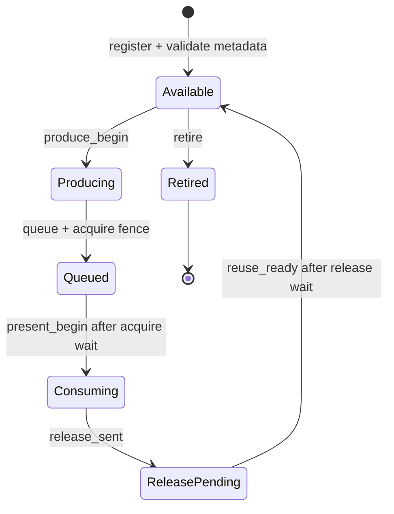

# gfxstream winsys contract

Status: required architecture gate; the gfxstream desktop profile remains
experimental.

## Decision

Vendor Vulkan and gfxstream remain the rendering path. A raw DMA-BUF or an
AHardwareBuffer handle is not, by itself, a display protocol. uDroid will not
promote another X11 WSI artifact fix until one owner validates the complete
resource lifecycle described here.

The previous desktop experiments distributed ownership between Mesa WSI,
Kumquat, Termux:X11 and the Android Surface. That allowed allocation and import
to succeed while layout, synchronization, reuse or device selection disagreed.
The recurring result was recognizable but corrupted output, followed by a
mixed session where KWin and Plasma selected different rendering paths.

The last protocol-v1 recovery point is the committed runtime pair:

- host runtime `5-0d9d623-1f2939dc0`;
- guest runtime `7-fb349a2d3b5`.

The later host-10/guest-8 modifier experiment is preserved in the original
dirty worktree. It is evidence, not a new baseline: its X11 root capture was
already corrupted before Termux:X11 reached the Android Surface.

Protocol-v2 development uses reproducible source checkpoints instead of that
dirty worktree:

- uDroid presenter `e4271e2`;
- Kumquat shared-resource identity and disconnect cleanup `85eb290`;
- gfxstream Android external-blob support `540f04125`;
- Mesa dedicated DMA-BUF import transport `271e35c5d2f`;
- packaged host runtime `9-85eb290-540f04125`;
- Mesa AHardwareBuffer swapchain contract `47eeedc6cc9`;
- packaged guest runtime `10-47eeedc6cc9`.

This pair is a test candidate, not a promoted desktop runtime. The internal
producer, cross-process resource sharing, standalone Vulkan, standalone Zink,
and nested Weston gates pass on the Pixel 6a. Xwayland remains blocked at the
standard render-device and allocator boundary described below.

## Production reference

AOSP Terminal uses a real virtio-gpu device and configures both
`gfxstream-vulkan` and `gfxstream-composer`. crosvm keeps resource identity,
allocator metadata, fences and display import in its virtio-gpu resource
manager. Android BufferQueue similarly owns slots and acquire/release fences
around `GraphicBuffer` objects.

uDroid cannot copy the privileged VM transport into a rootless PRoot process,
but it must preserve the same contracts:

1. one stable resource identity and generation;
2. allocator-authoritative width, height, format, planes, offsets, strides and
   modifier or an explicit AHardwareBuffer-native layout;
3. monotonic frame identity;
4. producer completion before presentation;
5. consumer release before resource reuse;
6. safe retirement on resize, surface replacement and process loss;
7. one truthful graphics device contract for Vulkan, EGL, GLX and compositor
   clients;
8. a controlled copy fallback when import cannot be proven correct.

## Resource state machine



Every event is keyed by `(resource, generation)`. A new generation never
revives an older in-flight resource. Every frame-bearing event carries the same
positive, monotonically increasing frame number from `produce_begin` through
`reuse_ready`.

Registration must fail closed when:

- dimensions, layer count, format or usage are invalid;
- stride is smaller than logical width;
- DMA-BUF plane layout is incomplete;
- an AHardwareBuffer description changes after socket transport;
- the same resource/generation is registered twice;
- an older generation is still in flight.

## Trace schema

The opt-in probe emits one JSON object per state transition after the marker
`UDROID_WINSYS`. Schema version 1 uses these common fields:

```json
{"schema":1,"event":"produce_begin","resource":1,"generation":1,"frame":42}
```

`register` additionally carries `surface_generation`, `width`, `height`,
`layers`, `format`, `usage` and `stride`. The validator is
`tools/graphics/winsys_trace_validator.py`; it accepts raw JSONL or Android
logcat lines containing the marker.

## Promotion order

KDE is not a validation probe. Gates must pass in this order:

1. deterministic AHardwareBuffer producer/presenter lifecycle;
2. multi-resource rotation and at least 1,000 reuse cycles;
3. resize, Surface detach/reattach and stale-generation rejection;
4. gfxstream resource flush with matching producer and presenter traces;
5. standalone Vulkan and Zink clients;
6. standalone QtQuick and X Composite workloads;
7. Weston with Xwayland as the first complete compositor boundary;
8. Plasma only after every process reports the same accelerated device.

Any visual corruption, contract violation, split renderer selection or
unattributed full-frame copy returns the profile to the preceding gate. The
Standard graphics profile remains the product fallback throughout.

Run the first trace gate with:

```sh
adb logcat -c
adb shell am start -n \
  org.randomcoder.udroid.dev/org.randomcoder.udroid.gfxstream.GfxstreamPresenterProbeActivity \
  --ez contractTrace true --ei resourceCycleFrames 120
# Let the deterministic probe run, then close it with Android Back.
adb logcat -d -s uDroid-Winsys:I | \
  python3 tools/graphics/winsys_trace_validator.py
```

## Measured checkpoint

Pixel 6a (`bluejay`, Mali-G78), 2026-08-29, dev APK built from this branch:

| Probe | Frames | Resources | In flight at shutdown | Result |
| --- | ---: | ---: | ---: | --- |
| steady AHardwareBuffer reuse | 2,246 | 1 | 0 | pass |
| replace buffer every 120 frames | 968 | 9 | 0 | pass |

Both captures remained visually intact at approximately 60 FPS with zero
reported swap or fence failures. The validator observed the complete lifecycle
for every accepted frame. This clears promotion gates 1 and 2 for the internal
deterministic producer only; it does not yet qualify gfxstream, X11, Weston or a
desktop compositor.

The same build also passed three Android Home/foreground detach cycles (643
frames across four retired resources) and a live `1080x2400 -> 720x1600 ->
1080x2400` replacement (550 frames across three retired resources). Each resize
used the allocator-reported stride: 1088, 720, then 1088. The validator rejects
synthetic stale generations, premature reuse and retirement while in flight;
an end-to-end stale-packet injection remains part of the external-producer
gate.

A short pacing audit recorded frame 1 at `11:36:14.502` and frame 409 at
`11:36:21.308`, or 60.09 accepted frames per second on the physical 60 Hz
display. Use `tools/graphics/run_winsys_contract_probe.sh` for subsequent
`steady`, `cycle`, `reattach`, and `resize` captures so timing and lifecycle
results come from the same log.

## External producer gate

The existing private AHardwareBuffer protocol version 1 is not promotable to a
desktop winsys. Its audit found four structural gaps:

1. packets identify a resource and generation but not a frame, so an acquire or
   release fence cannot be attributed to one exact submission;
2. the Android presenter retains only one external EGLImage, while a Vulkan
   swapchain and a desktop compositor keep multiple resources live;
3. Kumquat retains registrations until process exit and has no explicit retire
   message;
4. Android Surface detach destroys the current import without telling Kumquat,
   which continues to treat that resource as registered.

Protocol version 2 must therefore be a coordinated host/app change, not a
compatibility shim. It must add a positive monotonic frame id to every
frame-bearing packet and explicit `reuse_ready` and `retire` messages. The
Android side must own a registry keyed by `(resource, generation)` and retain
each imported AHardwareBuffer independently of the current Surface. Surface
loss pauses presentation; it does not silently retire producer resources.

The v2 implementation now exists on both endpoints. Kumquat assigns a frame id
per registered resource, waits for the matching release before announcing
reuse, and retires the resource on final context detach. The Android presenter
keeps a multi-resource registry across Surface replacement and rejects early
reuse, stale frames, stale generations, and retirement while a release is
pending. The opt-in contract mode also records a producer-side monotonic trace
in `no_backup/graphics/kumquat.log`; normal desktop launches leave this tracing
disabled.

Validate the two independent captures with:

```sh
python3 tools/graphics/winsys_dual_trace_validator.py \
  kumquat-producer.log android-presenter.log
```

The external gate passes only when a merged monotonic-clock trace proves all of
the following:

- at least three resources remain registered and rotate for 1,000 frames;
- every acquire and release carries the same frame id end to end;
- no resource is reused until its release is acknowledged;
- explicit retire removes exactly one generation;
- Surface detach/reattach preserves the registry and resumes without a fresh
  registration;
- stale frame, generation, reuse, and retire packets are rejected by both
  endpoints.

### External measured checkpoint

Pixel 6a (`bluejay`, Mali-G78), 2026-08-29, runtime
`7-5605f4c-36967251d` and guest `7-fb349a2d3b5`:

| Probe | Frames | Resources | Producer/presenter mismatches | Result |
| --- | ---: | ---: | ---: | --- |
| rotating external Vulkan images | 1,200 | 3 | 0 | pass |
| Surface detach/reattach while rendering | 600 | 3 | 0 | pass |

The first capture correlated 3,606 independent Kumquat events with 6,006
Android presenter events. Registration, queue, release, reuse and retire tuples
matched exactly. The second capture moved the Activity through Android Settings
and back. The Surface advanced from generation 1 to generation 3, while the
same three external resources continued without re-registration and retired
cleanly after frame 600.

The minimal Debian image needed its declared XCB runtime dependencies before
the current guest ICD could load. Shipping must either bundle those libraries
with the guest runtime or split the direct presenter ICD from X11 WSI so the
headless contract probe does not inherit unrelated X dependencies.

The guest import transport was rebuilt from the clean Mesa checkpoint
`109e79ea1bc`. Imported images no
longer infer a tightly packed stride after their Vulkan `pNext` chain is gone:
explicit modifier plane layouts are retained at image creation, linear images
query their actual subresource layout, opaque layouts fail closed, and a
dedicated image relationship is preserved for both DMA-BUF export and import.
The subsequent `47eeedc6cc9` checkpoint restores the Android WSI allocation
contract on top of that import transport: socket-presentable swapchain images
use linear DRM modifier metadata, native image memory and
AHardwareBuffer-backed allocation. It is packaged as guest runtime
`10-47eeedc6cc9` and paired with host runtime `9-85eb290-540f04125`. Android
host builds enable gfxstream's external synchronization and Vulkan blob color
buffer paths, so guest exports are real AHardwareBuffer-backed DMA-BUFs instead
of shared-memory descriptors mislabeled as DMA-BUFs.

Kumquat keys exported DMA-BUFs by their kernel `(device, inode)` identity.
Importing that descriptor from another gfxstream connection attaches the
existing Rutabaga resource to the new context instead of asking the proprietary
driver to construct a second image from the same allocation. The final context
detach retires the identity. Socket loss also destroys every context owned by
that connection and releases its attachments.

### Cross-process measured checkpoint

On the same Pixel 6a, an independent Vulkan producer and consumer passed the
following resource test with the packaged runtime sources above:

| Probe | Runs | Verified pixels per run | Content hash | Result |
| --- | ---: | ---: | --- | --- |
| AHB-backed DMA-BUF export, fence transfer, import and readback | 20 | 49,408 / 49,408 | `3bf16538da7f5d83` | pass |
| consumer `SIGKILL` after import, followed by a clean run | 1 | 49,408 / 49,408 after recovery | `3bf16538da7f5d83` | pass |

The crash probe released the orphaned context and shared resource without
restarting Kumquat. A subsequent producer/consumer pair completed normally,
which clears the cross-process identity, synchronization, deterministic content
and disconnect-cleanup gate. The qualification source is
`udroid_kumquat_dmabuf_probe.cpp` at Mesa checkpoint `109e79ea1bc`.

This clears the normal, multi-resource, Surface-replacement and two-process
DMA-BUF portions of the external gate. Malformed/stale packet injection remains
before promotion.

### WSI and compositor measured checkpoint

On the same Pixel 6a, guest runtime `10-47eeedc6cc9` passed the next gates in
their required order:

| Gate | Renderer or device | Outer Present result | Result |
| --- | --- | --- | --- |
| Vulkan XCB WSI (`vkcube`) | `Virtio-GPU GFXStream (Mali-G78)` | 60.0 FPS; 299-300 of 300 copies GPU-offloaded | pass |
| Zink GLX (`glxgears`) | `zink Vulkan 1.4 (Virtio-GPU GFXStream (Mali-G78))` | 60 FPS; all sampled copies GPU-offloaded | pass |
| Weston nested X11 | GL renderer on the same Zink device | 45-52 FPS during shell activity; sampled copies GPU-offloaded | pass |
| Xwayland GLX client | no GLAMOR/DRI3 device | no accelerated presentation contract | blocked |

The first three gates rendered without corruption. The Vulkan WSI allocated
three AHardwareBuffer-native swapchain images with explicit linear modifier
metadata. The independently built DMA-BUF producer/consumer probe also passed
20 consecutive runs after the WSI change, each matching 49,408 of 49,408
pixels with content hash `3bf16538da7f5d83`.

The Xwayland failure originally appeared to identify a missing render-device
and allocator contract. Later source comparison corrected that interpretation.
Google's Linux guest path uses Mesa's common Vulkan X11/Wayland WSI, and its
compositor terminates at the Android display backend. uDroid's AHardwareBuffer
X11 WSI similarly terminates at embedded Lorie. An ordinary nested Xwayland
server cannot receive Lorie's private AHardwareBuffer socket modifier, so a
`VK_ERROR_SURFACE_LOST_KHR` from that topology is expected and is not evidence
that the direct gfxstream WSI is broken.

The first two sub-gates of that boundary now pass on the Pixel 6a. Mesa
checkpoint `f064d8fb23b` keeps normal GBM device validation unchanged while
allowing an explicitly selected external backend to own a Unix socket
transport. Its negative and positive loader cases pass both in a clean ARM64
build and inside the uDroid Debian PRoot. Mesa checkpoint `ac8417243f0` adds an
independent surfaceless Zink/EGL consumer to the existing cross-process probe.
Ten consecutive Vulkan-producer to EGL-consumer runs imported the explicit
linear DMA-BUF layout and matched 49,408 of 49,408 pixels with hash
`3bf16538da7f5d83`; the original Vulkan consumer still passes unchanged.

This evidence removes the need for a fabricated DRM identity or a new EGL
platform. Mesa checkpoint `c10c2a5d19e` now adds the first real
socket-selected GBM allocator. It is loaded only by an explicit
`GBM_BACKEND=gfxstream`, requires an app-local Unix `SOCK_SEQPACKET` peer, and
compares the server credential with the Android kernel UID retained in
`/proc/self/status`. The procfs comparison is required because PRoot
`--root-id` virtualizes `getuid()` but does not change Android's kernel app
sandbox.

On the Pixel 6a, ten consecutive standard `gbm_bo_create()` calls allocated
AHardwareBuffer-backed linear `ABGR8888` images through gfxstream and exported
the same authoritative layout each time:

```text
GBM_BACKEND=gfxstream
GBM_BO=256x193 fourcc=0x34324241 planes=1 stride=1024 offset=0 modifier=0 size=221184
```

This clears GBM device creation, allocation, DMA-BUF export, plane metadata,
same-app transport validation, and repeated teardown. It is not yet a complete
desktop allocator: BO import, CPU mapping, GBM surfaces, explicit release
fences, resize, and disconnect recovery still fail closed or remain untested.
Those contracts remain useful for compositor internals, but the next display
gate is not another raw DRI3 path. First qualify direct Mesa WSI to Lorie across
surface detach, reattach, resize and host disconnect. A future Wayland route
must provide an Android-native final display backend; nested Xwayland can then
serve applications behind that compositor rather than pretending to be the
Android buffer receiver.

The allocator-to-renderer boundary passed on 2026-08-30. A standard
`gbm_bo_create()` allocation was exported and imported by an independent
surfaceless EGLDevice/Zink context. Mesa checkpoint `ea05ebe7134` restores the
non-zero memory requirement for supported external 32-bit images. Rutabaga
checkpoint `c1fb067365e` reference-counts multiple guest objects that alias one
resource/context. Five clean runs selected
`Virtio-GPU GFXStream (Mali-G78)`, GPU-cleared the imported BO, verified all
49,408 pixels, and released both aliases without a host protocol error. The
host's `(device, inode)` lookup hit in every run, so Android's vendor Vulkan
driver was not asked to re-import its AHardwareBuffer allocation as a raw
DMA-BUF.

The direct route was revalidated on 2026-08-30 with the packaged host runtime
`9-85eb290-540f04125` and guest runtime `10-47eeedc6cc9`. Debian `glxinfo -B`
reported accelerated Zink on the virtual Mali-G78, and a bounded `vkcube --wsi
xcb` run rendered correctly. Lorie sampled 270/270 then 297/297 GPU-offloaded
Present copies at 54.0 and 59.6 FPS. The real app-supervised launch also passes
in the `untrusted_app` domain, starts while the Display page is detached and
survives later surface attachment.

The prior status-1 result was caused by a stale `/usr/local/bin/vkcube` test
wrapper which shadowed Debian's `/usr/bin/vkcube` and launched an unrelated
Python GLX probe. The host-side `application:'python3'` trace was the decisive
signal. The rootfs was cleaned and the original bare-name desktop command was
retested successfully. Qualification scripts must therefore resolve and hash
their guest executable before comparing lifecycle or winsys results.

### Nested Wayland and Plasma boundary

The next diagnostic topology was exercised on the Pixel 6a on 2026-08-30:

```text
embedded Lorie :0
  -> Weston 14.0.2 X11 backend
    -> KWin Wayland nested backend
      -> Plasma 6 Wayland clients and Xwayland :1
```

Weston initialized its GL renderer on
`zink Vulkan 1.4 (Virtio-GPU GFXStream (Mali-G78))`. Its EGL display exposed
the Wayland platform, buffer age, swap-with-damage and explicit sync. A direct
Vulkan XCB client remained alive on the same Kumquat host, which also confirmed
that the compositor did not require exclusive access to the gfxstream service.

The complete Plasma process graph started: `startplasma-wayland`,
`plasma_session`, `kwin_wayland`, rootless `Xwayland :1` and `plasmashell` all
remained alive. This is not yet a rendering pass. KWin reported
`zwp_linux_dmabuf_v1 v4 or newer is needed`, and the nested Plasma output was
black.

Weston's earlier allocator diagnostics explain that failure:

```text
warning: failed to query rendering device from EGL
failed to initialize allocator
```

Weston 14's GL renderer creates its dmabuf allocator only when the EGL platform
already supplies a GBM device or when the EGL device exposes a DRM device path
that Weston can open and pass to `gbm_create_device()`. The same requirement is
still present in current upstream Weston. Rendering through Zink is therefore
not sufficient to publish the standard Wayland dmabuf protocol.

This result narrows the next implementation gate. Socket-backed gfxstream GBM
allocation, import and authoritative plane metadata now pass independently.
The allocator must be connected to a truthful compositor render-device and
linux-dmabuf feedback mapping, then gain surfaces and explicit release
synchronization. Once Weston publishes `zwp_linux_dmabuf_v1` v4 from that
allocator, rerun the native Wayland client and Plasma unchanged. Do not add a
Plasma renderer override or fabricate a DRM node to bypass this gate.

The relevant upstream allocator code is
[Weston 14.0.2 `gl_renderer_allocator_create()`](https://gitlab.freedesktop.org/wayland/weston/-/blob/14.0.2/libweston/renderer-gl/gl-renderer.c).

Nested X server ownership is also part of the standard session contract. PRoot
launches now bind both `/tmp/.X11-unix` and the matching `/tmp/.X0-lock` into
the guest. With only the socket visible, Xwayland incorrectly claimed `:0` and
unlinked Lorie's live X0 socket. With both visible, Lorie retains `:0`, Xwayland
selects `:1`, and the outer display remains reachable after Weston exits.
