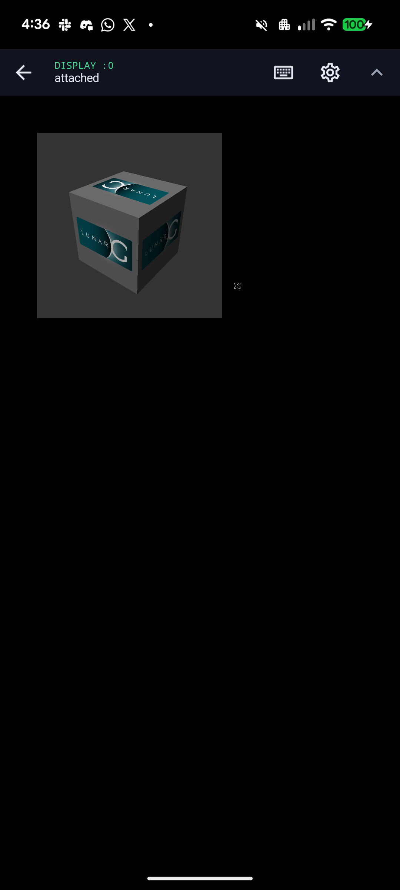
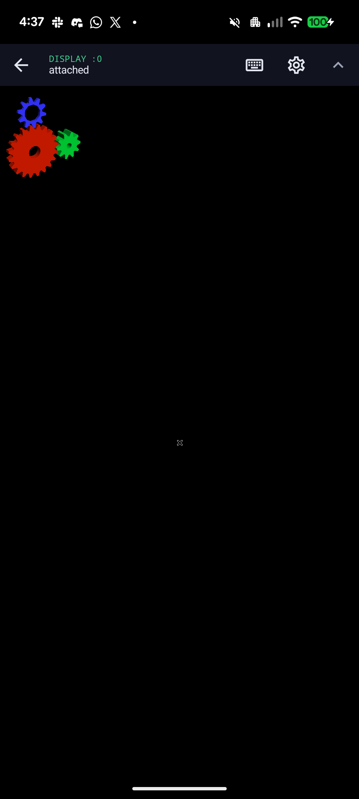
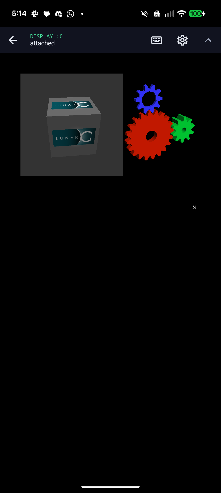
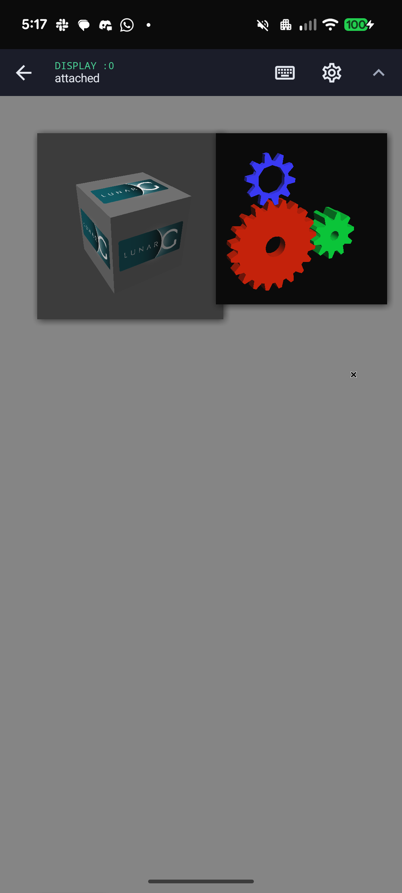

# gfxstream Android Surface presenter

Status: experimental, dev-build probe only.

The Android behavior and promotion gates for this work are defined in
[AOSP Terminal graphics reference](AOSP_TERMINAL_REFERENCE.md). New presenter
patches must preserve those surface lifecycle, buffer ownership, allocator
geometry and input contracts.

This checkpoint proves the public Android presentation boundary needed by the
optional gfxstream graphics profile:

```text
AHardwareBuffer -> Unix socket -> EGLImage -> GLES GPU blit -> SurfaceFlinger
```

The existing Termux:X11 desktop remains the default and is not changed by this
experiment. `AhbSurfacePresenterView` is reusable production code, while
`GfxstreamPresenterProbeActivity` exists only in the `dev` source set.

The probe renders a deterministic checkerboard and moving scan line into an
AHardwareBuffer from an independent producer EGL context. It registers the
buffer through Android's public `AHardwareBuffer_sendHandleToUnixSocket` API;
the presenter receives a separate reference, imports it as an EGLImage, and
samples it into an app-owned Surface. Every frame crosses explicit Android
native acquire and release fence file descriptors via `SCM_RIGHTS`. The
producer does not reuse the AHB until the returned release fence has been
consumed. Its overlay reports the actual GL renderer, recent frame rate,
Surface generation, current buffer geometry, swap failures, fence failures,
and transport failures.

The local protocol is defined in `app/src/main/cpp/ahb_transport_protocol.h`.
The presenter binds a `0600` `SOCK_SEQPACKET` listener below the app's private
no-backup directory and accepts only a peer whose `SO_PEERCRED` uid matches the
uDroid app uid. The current deterministic producer connects from the same
process; the listener boundary is ready for a separately supervised renderer
running under that uid.
A registration packet is followed by Android's public AHB handle message.
Acquire and release packets each carry exactly one sync-file descriptor. Every
packet includes a resource id and generation so stale resize or lifecycle
traffic can be rejected. On Android 12 and newer, the probe also compares the
system-wide AHardwareBuffer id on both sides of the socket and rejects an
identity mismatch. The ancillary-data parser closes excess descriptors and
rejects truncated or malformed fence messages.

The presenter now also has a dormant external-producer mode. It waits for a
same-UID supervised process without blocking Activity teardown, imports the
producer's public AHardwareBuffer handle, waits on one matching acquire sync FD
per frame, and returns a release sync FD before that resource may be reused.
The mode is available only through the dev probe's `externalProducer` intent
extra; normal uDroid graphics and the default deterministic probe remain
unchanged. A transport connection or a registered AHardwareBuffer alone is not
counted as a rendered gfxstream frame.

## Run the probe

```sh
./gradlew :app:assembleDev
adb install -r app/build/outputs/apk/dev/app-dev.apk
adb shell am start -n \
  org.randomcoder.udroid.dev/org.randomcoder.udroid.gfxstream.GfxstreamPresenterProbeActivity
```

The separately supervised Android-host Kumquat path remains opt-in and can be
started only from the development Activity:

```sh
adb shell am start -n \
  org.randomcoder.udroid.dev/org.randomcoder.udroid.gfxstream.GfxstreamPresenterProbeActivity \
  --ez externalProducer true
```

## Pixel 6a checkpoint

The Android 17 Pixel 6a probe passed:

- AHardwareBuffer allocation and EGLImage import;
- public Unix-socket AHB registration and sync-file transport;
- GPU rendering into and sampling from the same AHB;
- app background and Surface recreation;
- live display-size replacement from 1080x2400 to 720x1280 and back;
- 20 repeated Surface detach/reattach cycles with five geometry replacements;
- three repeated APK replacement installs and cold launches;
- more than 12,000 presented frames at 59.8-60.1 FPS with zero transport or
  native-fence failures.

The original moving scan line advanced roughly 3.2 physical pixels per 60 Hz
refresh and the renderer paced itself with a free-running 16.667 ms sleep while
EGL also used swap interval one. A later three-run sample exposed the phase
drift: p95 reached 19.9-20.8 ms and 4-11 of 62 intervals exceeded 20 ms.

The probe now takes frame timestamps from Android `Choreographer`, coalesces a
late callback to the newest pending frame, and moves the scan line by less than
one pixel per refresh. Three post-change samples averaged 16.698-16.719 ms,
p95 was 17.864-18.111 ms, the maximum was 19.238 ms, and no interval exceeded
20 ms. This pacing belongs to the Android presenter; it does not claim that a
genuine gfxstream guest frame has reached the Surface.

One pre-stress run produced a persistent black source image while EGL swaps and
fence counters continued normally. A cold process restart recovered it. The
failure did not recur across the lifecycle, geometry, or reinstall matrix above,
so this checkpoint records it as an unresolved visual-correctness observation
rather than claiming that clean transport counters alone prove correct pixels.

## Forked renderer checkpoint

The external work is isolated in organization forks:

- `RandomCoderOrg/rutabaga_gfx`, branch `feat/kumquat-resource-flush`, defines
  a collision-free resource-flush command, parses its damage rectangle, waits
  for an explicit no-data response, and forwards the resource to gfxstream's
  existing `stream_renderer_flush()` path.
- `RandomCoderOrg/gfxstream`, branch `feat/android-ahb-socket-export`, exposes
  an Android-only unstable function that sends an AHardwareBuffer-backed
  renderer resource with `AHardwareBuffer_sendHandleToUnixSocket`. It does not
  inspect the private native handle or reconstruct allocation metadata.

The uDroid development APK now packages a stripped ARM64 Android Kumquat host
and its matching NDK C++ runtime. An immutable manifest records the gfxstream,
Rutabaga and guest-protocol revisions plus SHA-256 digests. Installation uses a
private staging directory, verifies both binaries before activation, and then
renames the complete runtime atomically. Other Android ABIs fail closed instead
of borrowing an incompatible executable.

With `externalProducer=true`, the development Activity owns Kumquat's lifetime
and passes explicit private guest and presenter socket paths. A Pixel 6a device
run verified the child process, both socket listeners and the same-UID presenter
connection. Force-stopping uDroid removed the child and both sockets, so the
experiment does not leave a renderer behind. The normal Termux:X11 path still
does not start or install this host.

## Verified guest-frame checkpoint

The matching Mesa guest now renders a genuine Vulkan image through the
supervised host:

```text
guest Vulkan command -> gfxstream -> Android Mali Vulkan driver
  -> AHardwareBuffer -> uDroid EGLImage presenter -> SurfaceFlinger
```

The device probe creates an optimal-tiling, DMA-BUF-exportable RGBA image,
clears it on the guest Vulkan queue, and presents its backing Kumquat resource.
Mesa preserves the dedicated-image allocation chain required by Android AHB
imports and records the image-to-memory binding used by the private development
present call. The virtual resource uses the packed 32-bit transport stride
instead of querying a vendor-private optimal image layout.

Kumquat's current acquire fence is a pollable eventfd, not an Android
`sync_file`. The uDroid presenter therefore waits for it with blocking
`poll(2)` before sampling the AHB. Android still returns a native release fence,
which the guest waits on before reusing the image. This is explicit ordering
without a busy loop or CPU pixel upload. Exporting a native host Vulkan sync FD
would remove the CPU-side acquire wait later, but is not required for correct
pixels.

On the Pixel 6a, the clean committed build reported `Virtio-GPU GFXStream
(Mali-G78)`, completed 180/180 explicit-fence frames, and showed zero swap and
fence failures. A second run held the final optimal-tiling frame long enough to
capture the rendered red image:


This proves the first real guest frame and synchronization boundary. Termux:X11
remains uDroid's default.

## Standard Vulkan loader checkpoint

The development APK now includes a matching, stripped ARM64 guest runtime:

- Mesa's gfxstream Vulkan ICD from commit `636bbd628a9`;
- its `libdrm` and `libexpat` runtime dependencies;
- a standard Vulkan ICD JSON file; and
- a small opt-in launcher that scopes `VIRTGPU_KUMQUAT`, `VK_DRIVER_FILES`,
  `VK_ICD_FILENAMES`, and `LD_LIBRARY_PATH` to one guest command.

The host and guest bundles share the same digest-verified, atomic asset
installer. An APK build gate checks every declared SHA-256 digest and also
requires the guest library to contain the Mesa revision declared by its
manifest. This prevents a stale binary from being packaged under a newer
runtime version.

The guest profile binds the immutable runtime at `/opt/udroid/gfxstream` and
the app-private Kumquat socket at `/tmp/kumquat-gpu-0`; it does not copy files
into or modify the distro rootfs. On the Pixel 6a, Debian Trixie's unmodified
Vulkan loader and `vulkaninfo --summary` reported:

```text
deviceType         = PHYSICAL_DEVICE_TYPE_VIRTUAL_GPU
deviceName         = Virtio-GPU GFXStream (Mali-G78)
driverName         = gfxstream (Mali-G78)
driverInfo         = Mesa 26.3.0-devel (git-636bbd628a)
```

This is the first standard-loader proof; it no longer relies on the private
direct-link frame probe to discover the driver. It does not yet prove X11 WSI,
Zink, KDE, or Firefox presentation. The profile remains dormant until an
individual command is explicitly launched with it, and the existing
Termux:X11 graphics path is unchanged. The next gate is an ordinary Vulkan
application followed by a separately validated X11 WSI path.

## AHardwareBuffer X11 WSI checkpoint

The standard X11 WSI now presents the same Vulkan image rendered by gfxstream,
without a CPU pixel copy:

```text
Linux Vulkan application -> Mesa gfxstream -> Android Mali Vulkan
  -> AHardwareBuffer -> Termux:X11 EGLImage -> Android Surface
```

The black-window failure was an ownership bug. Rendering and guest-side image
readback were correct, and the same AHardwareBuffer reached Termux:X11, but the
guest queue never released the image to `VK_QUEUE_FAMILY_EXTERNAL`. Mesa now
records one release command buffer per swapchain image and queue family, and
submits it after application rendering and before X11 Present. The Android
DMA-BUF implicit-fence path then orders Termux:X11's EGL consumer without a
per-frame CPU wait.

On the Pixel 6a, an unmodified Debian `vkcube --wsi xcb` selected
`Virtio-GPU GFXStream (Mali-G78)`, remained visually correct without the former
`UDROID_GFXSTREAM_WSI_WAIT` serialization, and Termux:X11 reported 59.8-60.0
FPS with every sampled Present copy GPU-offloaded. The packaged launcher no
longer enables the byte-dump or CPU-wait probes.



This first validated one Vulkan X11 application, not yet a complete desktop.

Host and guest runtime IDs are versioned independently of their source commit
labels. A dirty-tree rebuild can change the Kumquat or Mesa payload without
changing the pinned commit, so every packaged binary change must also advance
its runtime ID and digest. This prevents the verified installer from reusing a
previous host with a newer guest protocol implementation.

## Zink and buffer-format checkpoint

The GLX gate now passes through the same host runtime. Debian's unmodified
`glxinfo -B` reports direct rendering, `Accelerated: yes`, and
`zink Vulkan 1.4 (Virtio-GPU GFXStream (Mali-G78))`. `glxgears` renders with
the expected red, green, and blue channels. Its uncapped result was roughly
295-305 FPS on the Pixel 6a; this proves work is reaching the display but is
not a frame-pacing benchmark.



Android gralloc on this device rejects deprecated BGRA AHardwareBuffer
allocation. The guest therefore keeps the application's BGRA image semantics
while backing scanout with a mutable RGBA Vulkan image. The private X11
transport now separates the physical buffer format from its content semantics:

- `1255`: RGBA AHardwareBuffer carrying BGRA-compatible content; the X11
  renderer applies its channel swizzle.
- `1257`: RGBA AHardwareBuffer carrying native RGBA content; the X11 renderer
  samples it without the swizzle.

Before `1257`, direct Vulkan rendered the LunarG texture with visibly swapped
brown channels. The paired client/server change restores its cyan/teal colors
without regressing GLX. The server publishes the versioned root-window
property `_UDROID_X11_BUFFER_TRANSPORT`; the verified value is
`1, 11, 1255, 0, 1257, 0`, advertising AHardwareBuffer socket transport, RGBA
content semantics, and GPU-copy support. It deliberately does not advertise
an explicit sync-file capability: this checkpoint uses Vulkan external queue
ownership plus Android DMA-BUF implicit synchronization.

The lifecycle, multi-client and compositor gates below now pass. Gfxstream
still reports two capability issues that must be resolved rather than hidden:
the guest/host `pLayeredApis` unmarshal mismatch and missing
`fillModeNonSolid`/`shaderClipDistance` in the virtual physical-device feature
set.

## Detached display lifecycle checkpoint

The first launch through uDroid's normal desktop supervisor exposed a lifecycle
failure that the manually attached Termux:X11 tests could not reveal. Starting
`vkcube` while the Display page was closed left the Android renderer detached.
Lorie then treated the missing renderer as permission to fall back from its GPU
Present queue to an EXA CPU copy. The imported gfxstream AHardwareBuffer was a
valid GPU texture but intentionally lacked CPU read/write usage, so Android
gralloc rejected `AHardwareBuffer_lock()` and EXA terminated the X server after
`PrepareAccess` failed on its pinned pixmap.

Imported AHardwareBuffer pixmaps now retain their pending Present request when
the renderer is detached or its queue is temporarily full. The request is
rechecked on the normal fake-vblank cadence and resumes through the GPU copy
queue after a renderer reconnects. There is no CPU map, pixel upload, or busy
wait, and the guest naturally stops producing when its swapchain fills while
the display remains detached.

The packaged dev APK passed the original detached-start reproduction followed
by three Display detach/reattach cycles. X11, Kumquat, PRoot and `vkcube`
remained alive throughout, the original cyan LunarG texture resumed on every
reattach, and the log contained no gralloc lock, `PrepareAccess`, or X-server
termination failure.

The same session then passed four forced WindowManager rotations between
1080x2400 and 2400x1080. The app, X11 and `vkcube` retained the same process IDs,
Lorie reported 58.2-60.0 FPS with every measured Present copy GPU-offloaded,
and no lifecycle-failure signature appeared. Android auto-rotation was restored
after the probe.

The multi-client gate kept that Vulkan client alive while a second PRoot
process ran stock Debian `glxinfo` and `glxgears` through the same packaged
guest, Kumquat host and X server. `glxinfo` reported direct rendering through
Zink and `Virtio-GPU GFXStream (Mali-G78)`. Both windows rendered correctly;
Lorie remained near 60 FPS and offloaded every one of 1,958-2,684 Present copies
per five-second sample. No fatal lifecycle signature appeared. `glxgears`
reported 398-488 application loops per second, which is evidence that its swap
loop is not display-paced and must not be presented as visible frame rate.




The compositor micro-workload added Debian's 26 KB `xcompmgr` package and ran
client-side Composite redirection with shadows and fades over both windows.
The redirected Vulkan and Zink/GLX pixmaps remained correct, Lorie held
59.8-60.0 FPS, and every one of 1,542-1,836 Present copies in each measured
five-second sample was GPU-offloaded. No lifecycle-failure signature appeared.



The next system-level gate is an opt-in desktop session using the same packaged
profile. The known protocol and virtual-feature warnings remain tracked
separately and must not be hidden by the launcher.
